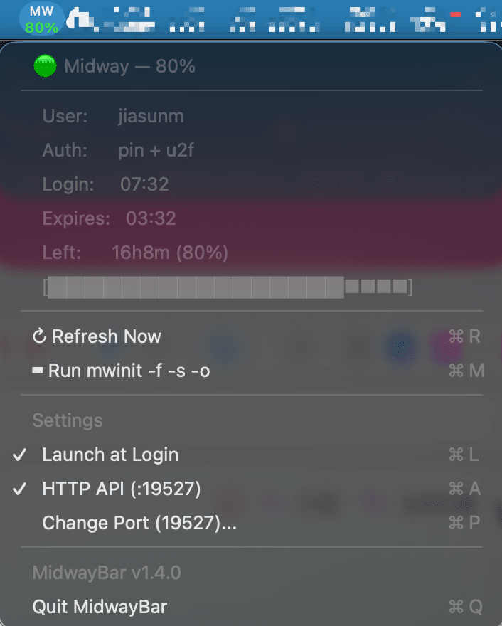

# 🔐 MidwayBar

[](https://www.apple.com/macos/)
[](https://swift.org)
[]()
[]()
[]()

**A lightweight macOS menu bar app that monitors your Amazon Midway session status in real-time — like a battery indicator for your authentication.**



---

## 😤 The Problem

Every Amazon employee knows this pain:

> You're deep in work. SSH fails. `builder-mcp` stops responding. Outlook kicks you out. Internal tools return 401.
>
> **Was it Midway? Is your session still valid? How much time do you have left?**
>
> There's no built-in way to check. You either run `mwinit` again (annoying) or guess (risky).

Midway has **three different cookies** with different lifetimes, and any of them expiring breaks different things:

| Cookie | Lifetime | What breaks |
|--------|----------|-------------|
| AEA Posture Cookie | ~2 hours | Internal websites, builder-mcp, Outlook |
| SSH Certificate | ~12 hours | git, SSH to hosts |
| Session Cookie | **~20 hours** | Everything |

## ✨ The Solution

**MidwayBar** — always visible in your menu bar, always up to date.

### Features

| Feature | Description |
|---------|-------------|
| 📊 **Menu bar indicator** | Compact two-line `MW` + percentage, always visible |
| 🎨 **Color-coded status** | 🟢 >50% · 🟡 20-50% · 🔴 <20% · 🔴 Expired |
| 📋 **Click to expand** | User, auth method, login/expiry time, progress bar |
| 🔄 **Auto-refresh** | Updates every 30 seconds |
| 🚀 **Launch at Login** | Toggle from Settings menu, persists across reboots |
| 🌐 **HTTP API** | Optional local API for other tools to query status |
| ⌨️ **Quick mwinit** | One-click to open Terminal and run `mwinit -f -s -o` |
| 🪶 **Tiny footprint** | ~125KB binary, zero dependencies, minimal CPU/memory |

---

## 📦 Install

### Option A: DMG (recommended for sharing)

1. Download `MidwayBar-v1.6.0.dmg` from Releases
2. Double-click to mount
3. Drag `MidwayBar.app` to `/Applications`
4. Open from Applications — look for `MW` in your menu bar
5. Click menu → Settings → **Launch at Login** ✓

### Option B: Build from source

```bash
git clone <repo-url> MidwayBar
cd MidwayBar
./install.sh    # Builds, installs, starts, configures auto-launch
```

### Prerequisites

- macOS 13+ (Ventura or later)
- Xcode Command Line Tools (`xcode-select --install`) — only for building from source
- Valid Midway credentials (`mwinit -f -s -o`)

---

## 🖥️ Usage

### Menu Bar

| Display | Meaning |
|---------|---------|
| `MW` / `99%` (green) | Healthy — more than 50% remaining |
| `MW` / `45%` (yellow) | Aging — plan to re-authenticate soon |
| `MW` / `12%` (red) | Critical — renew now before things break |
| `MW` / `N/A` (red) | Not authenticated or session expired |

### Keyboard Shortcuts

| Shortcut | Action |
|----------|--------|
| ⌘R | Refresh status now |
| ⌘M | Open Terminal and run `mwinit -f -s -o` |
| ⌘L | Toggle Launch at Login |
| ⌘A | Toggle HTTP API |
| ⌘P | Change API port (when API is enabled) |
| ⌘Q | Quit MidwayBar |

### Daily Workflow

```bash
# Run once every morning — gives you ~20 hours
mwinit -f -s -o
```

Then forget about it. MidwayBar shows you when it's time to re-authenticate.

---

## 🌐 HTTP API

Optional local API for other tools (scripts, CI/CD, MCP servers) to check Midway status.

**Enable:** Click menu → Settings → HTTP API

### Endpoint

```
GET http://127.0.0.1:19527/status
```

### Response

```json
{
  "authenticated": true,
  "user": "jiasunm",
  "auth_method": "pin + u2f",
  "percent": 83,
  "remaining_seconds": 59956,
  "remaining": "16h39m",
  "expires_at": 1776454336,
  "status": "healthy"
}
```

### Status Values

| `status` | Meaning |
|----------|---------|
| `healthy` | >50% remaining |
| `warning` | 20-50% remaining |
| `critical` | <20% remaining |
| `expired` | Session expired or not authenticated |

### Configuration

- **Default port:** 19527
- **Custom port:** Menu → Settings → Change Port
- **Security:** Listens on `127.0.0.1` only (not accessible from network)
- **Persistence:** API on/off state and port number survive app restarts

### Example: Pre-flight check in scripts

```bash
status=$(curl -sf http://127.0.0.1:19527/status | python3 -c "import sys,json; print(json.load(sys.stdin)['status'])")
if [ "$status" != "healthy" ]; then
  echo "⚠️ Midway session is $status — run mwinit -f -s -o"
  exit 1
fi
```

---

## 🏗️ How It Works

```
┌─────────────────────────────────────────┐
│           MidwayBar (menu bar)          │
│  ┌─────┐  ┌──────────┐  ┌───────────┐  │
│  │ MW  │  │ Dropdown  │  │ HTTP API  │  │
│  │ 83% │  │  Panel    │  │ :19527    │  │
│  └─────┘  └──────────┘  └───────────┘  │
│              ↑ every 30s                │
│     curl → Midway API → parse JSON     │
│     ~/.midway/cookie (read-only)        │
└─────────────────────────────────────────┘
```

1. Calls `https://midway-auth.amazon.com/api/session-status` via `curl`
2. Reads `~/.midway/cookie` for authentication (read-only, never modified)
3. Parses `auth_time` and `expires_at` from JSON response
4. Calculates remaining time and percentage
5. Updates menu bar icon and color every 30 seconds

---

## 📁 Project Structure

```
MidwayBar/
├── Package.swift              # Swift Package Manager
├── MidwayBar/
│   └── main.swift             # All source (~280 lines)
├── AppIcon.icns               # App icon (shield + lock + MW)
├── screenshots/
│   └── menu.png               # Screenshot for README
├── install.sh                 # One-click install script
├── uninstall.sh               # Clean uninstall
├── dist/                      # Build artifacts (git-ignored)
│   ├── MidwayBar.app/         # macOS App Bundle
│   └── MidwayBar-v1.6.0.dmg  # DMG installer
└── README.md
```

---

## 🔧 Troubleshooting

| Problem | Solution |
|---------|----------|
| Shows `N/A` | Run `mwinit -f -s -o` to authenticate |
| App disappears when closing Terminal | Install via DMG to `/Applications`, or use `launchctl` |
| API not responding | Enable in menu → Settings → HTTP API |
| Port already in use | Change port via menu → Settings → Change Port |
| Icon not showing | Check if another instance is running: `ps aux \| grep MidwayBar` |

---

## 📝 Version History

| Version | Date | Changes |
|---------|------|---------|
| v1.6.0 | 2026-04-17 | Custom API port, persistent settings |
| v1.5.0 | 2026-04-17 | App icon, API toggle in Settings |
| v1.4.0 | 2026-04-17 | HTTP API, DMG installer |
| v1.2.0 | 2026-04-17 | Launch at Login, Settings menu |
| v1.1.0 | 2026-04-17 | Compact UI, font optimization |
| v1.0.0 | 2026-04-16 | Initial release |

---

## 🤝 Contributing

```bash
# Build and test
swift build -c release

# Package DMG
./install.sh  # or manually: hdiutil create ...

# Commit
git add -A && git commit -m "feat: description"
git tag -a vX.Y.Z -m "vX.Y.Z"
```

---

## 📄 License

Internal use only — built for Amazon employees.

---

**Built with ❤️ by Neo Sun** · Inspired by [iStat Menus](https://bjango.com/mac/istatmenus/) and the universal pain of expired Midway sessions.
