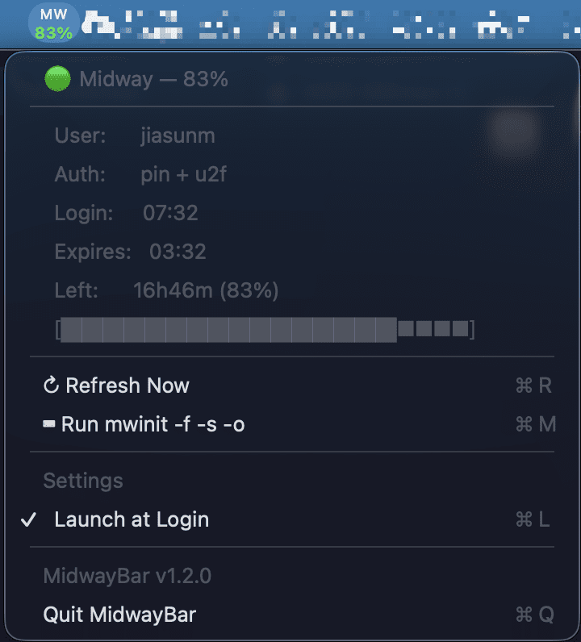

# 🔐 MidwayBar

A lightweight macOS menu bar app that monitors your Amazon Midway session status in real-time — like a battery indicator for your authentication.



## Features

- **Menu bar indicator** — Compact two-line display showing `MW` and remaining percentage
- **Color-coded status** — 🟢 Green (>50%) | 🟡 Yellow (20-50%) | 🔴 Red (<20%) | 🔴 N/A (expired)
- **Click to expand** — Full session details: user, auth method, login/expiry time, progress bar
- **Auto-refresh** — Updates every 30 seconds
- **Launch at Login** — Toggle from the Settings menu, persists across reboots
- **Quick actions** — ⌘R Refresh, ⌘M Run mwinit, ⌘Q Quit
- **Zero dependencies** — Pure Swift + AppKit, no third-party libraries
- **Tiny footprint** — ~125KB binary, minimal CPU/memory usage

## Why?

Every Amazon employee knows the pain: you're deep in work, then SSH fails, builder-mcp stops, Outlook kicks you out. Was it Midway? Is your session still valid? How much time do you have left?

MidwayBar answers that at a glance — always visible in your menu bar.

## Midway Session Lifecycle

| Cookie Type | Lifetime | What breaks when it expires |
|-------------|----------|---------------------------|
| AEA Posture Cookie | ~2 hours | Internal websites, builder-mcp, Outlook |
| SSH Certificate | ~12 hours | git, SSH to hosts |
| Session Cookie | ~20 hours | Everything (MidwayBar tracks this one) |

## Install

### Quick Install (recommended)

```bash
git clone <repo-url> MidwayBar
cd MidwayBar
swift build -c release
cp .build/release/MidwayBar ~/bin/midway-bar
chmod +x ~/bin/midway-bar
```

### Set Up Background Service

```bash
# Copy the launchd plist
cp com.neo.midwaybar.plist ~/Library/LaunchAgents/

# Start the service (runs in background, survives Terminal close)
launchctl load ~/Library/LaunchAgents/com.neo.midwaybar.plist
```

### Enable Launch at Login

Click the MidwayBar menu → **Settings** → **Launch at Login** (⌘L)

## Usage

| Action | How |
|--------|-----|
| Check status | Glance at menu bar — `MW` with colored percentage |
| View details | Click the menu bar icon |
| Refresh | ⌘R or click "↻ Refresh Now" |
| Renew session | ⌘M or click "⌨ Run mwinit -f -s -o" |
| Toggle auto-start | ⌘L or click "Launch at Login" |
| Quit | ⌘Q |

### Recommended Daily Workflow

```bash
# Run once every morning — gives you ~20 hours
mwinit -f -s -o
```

Then forget about it. MidwayBar will show you when it's time to re-authenticate.

## Menu Bar States

| Display | Meaning |
|---------|---------|
| `MW` / `99%` (green) | Session healthy, >50% remaining |
| `MW` / `45%` (yellow) | Session aging, plan to re-auth soon |
| `MW` / `12%` (red) | Session critical, renew now |
| `MW` / `N/A` (red) | Not authenticated or session expired |

## How It Works

1. Calls `https://midway-auth.amazon.com/api/session-status` via `curl`
2. Reads `~/.midway/cookie` for authentication
3. Parses `auth_time` and `expires_at` from the JSON response
4. Calculates remaining time and percentage
5. Updates the menu bar icon every 30 seconds

The app is **read-only** — it never modifies your session or cookies.

## Requirements

- macOS 13+ (Ventura or later)
- Valid Midway credentials (`mwinit -f -s -o`)
- `curl` (pre-installed on macOS)

## Project Structure

```
MidwayBar/
├── Package.swift              # Swift Package Manager config
├── MidwayBar/
│   └── main.swift             # All source code (single file, ~230 lines)
├── screenshots/
│   └── menu.png               # App screenshot
├── com.neo.midwaybar.plist    # launchd config for background service
├── README.md                  # This file
└── .gitignore
```

## Troubleshooting

| Problem | Solution |
|---------|----------|
| Shows `N/A` | Run `mwinit -f -s -o` to authenticate |
| App disappears when closing Terminal | Use `launchctl load` to start (see Install section) |
| Menu bar icon too wide/small | Edit `StatusBarView` dimensions in `main.swift` |
| Percentage stuck | Click ↻ Refresh (⌘R) or check if Midway session expired |

## Tech Stack

- Swift 5.9
- AppKit (NSStatusItem, NSMenu)
- SMAppService (Launch at Login)
- Swift Package Manager
- No third-party dependencies

## Version History

| Version | Date | Changes |
|---------|------|---------|
| v1.2.0 | 2026-04-17 | Launch at Login, Settings menu, AppleScript mwinit |
| v1.1.0 | 2026-04-17 | Compact UI, font optimization, mwinit -f -s -o |
| v1.0.0 | 2026-04-16 | Initial release |

## License

Internal use only — built for Amazon employees.
